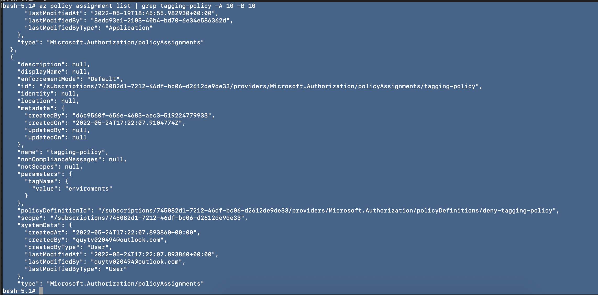

# Azure Infrastructure Operations Project: Deploying a scalable IaaS web server in Azure

### Introduction
For this project, you will write a Packer template and a Terraform template to deploy a customizable, scalable web server in Azure.

### Getting Started
1. Clone this repository

2. Create your infrastructure as code

3. Update this README to reflect how someone would use your code.

### Dependencies
1. Create an [Azure Account](https://portal.azure.com)
2. Install the [Azure command line interface](https://docs.microsoft.com/en-us/cli/azure/install-azure-cli?view=azure-cli-latest)
3. Install [Packer](https://www.packer.io/downloads)
4. Install [Terraform](https://www.terraform.io/downloads.html)

### Instructions

#### 0. Export the variable
export ARM_SUBSCRIPTION_ID="xxxx"
export ARM_CLIENT_SECRET="xxxx"
export ARM_CLIENT_ID="xxx"

#### 1. Policy

See documentation [here](policy/README.md)


#### 2. Create a resource group
```bash
az group create -n udacity-quytran  --location southindia --tags enviroments=test
{
  "id": "/subscriptions/745082d1-7212-46df-bc06-d2612de9de33/resourceGroups/udacity-quytran",
  "location": "southindia",
  "managedBy": null,
  "name": "udacity-quytran",
  "properties": {
    "provisioningState": "Succeeded"
  },
  "tags": {
    "enviroments": "test"
  },
  "type": "Microsoft.Resources/resourceGroups"
}

```

#### 3. Create Service Principal

```azure-cli
az ad sp create-for-rbac --name service-principal-quytran --role Contributor --scopes /subscriptions/745082d1-7212-46df-bc06-d2612de9de33/resourceGroups/udacity-quytran
```

#### 4. Terraform import resource group
```
  # https://registry.terraform.io/providers/hashicorp/azurerm/latest/docs/resources/resource_group#import
  terraform import azurerm_resource_group.rg /subscriptions/745082d1-7212-46df-bc06-d2612de9de33/resourceGroups/udacity-quytran
```
#### 5. Packer

```
packer build packer/server.json
```

#### 5. Terraform
```
  terraform plan -out solution.plan
```
### Output


[Packer](images/packer-result.txt "Packer")
[Terraform](images/terraform-plan.txt "Terraform")
